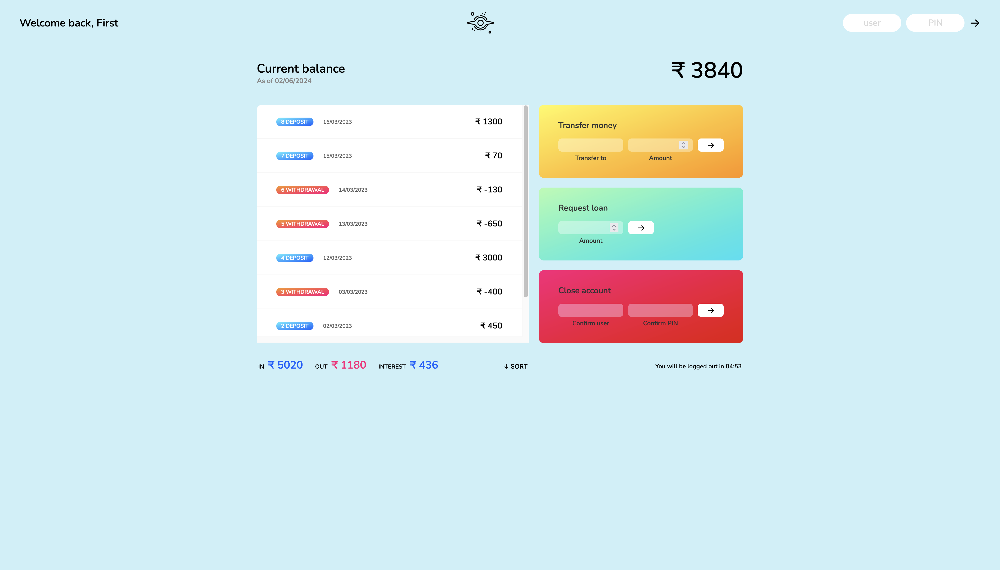

# 🏦 Galactic Credits Union App

A website showcasing essential banking features in a futuristic theme. The app provides a user-friendly interface to perform basic financial operations such as loans, transfers, and account management, with additional functionalities for sorting transaction data.

Link: [https://anshusinha26.github.io/Galactic-Credits-Union](https://anshusinha26.github.io/Galactic-Credits-Union)

---

## 📸 Screenshots

---

## ✨ Features

- Loan Management: Request and process loans seamlessly.
- Money Transfers: Transfer credits between accounts securely.
- User Authentication: Login and logout functionality for secure access.
- Transaction Sorting: Organize and sort money transfer data effectively.
- Intuitive Design: Simple and responsive interface for a smooth user experience.
- 
---

## ⚙️ Tech Stack

- HTML: For structuring the website.
- CSS: To style and enhance the user interface.
- JavaScript: To implement functionality and interactivity.
